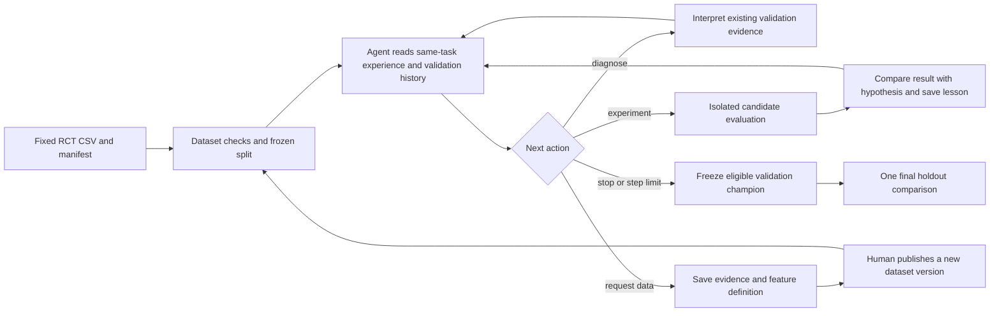

# Experiment architecture

`src/couponevo/data.py` validates the randomized data and declared pre-treatment features. `search.py` keeps the objective, budget, seed, manifest, evaluator, and candidate snapshots fixed for a resumable search. `agent.py` chooses whether to diagnose, experiment, request data, or stop; experiment proposals choose among draft, improve, debug, and crossover without a fixed model family. After each experiment, the Agent records a validation-only reflection against its expected result. A standalone data request records a missing feature's definition, source, pretreatment timing, evidence, and validation plan, then ends the current search until a human publishes a new dataset version. `sandbox.py` executes generated code in a restricted Docker container. `evaluate.py` and `cli.py` produce policy estimates, cost checks, uncertainty intervals, and reports independently of the proposed candidate. A feature-leakage review flag, failed analysis, or invalid reflection blocks champion promotion.

The journal contains within-search decisions, diagnoses, and hypothesis reflections. `experience.py` may summarize recent **validation-only** lessons, including failed experiments, from earlier finalized searches when the raw dataset SHA-256, manifest SHA-256, objective, budget, split seed, evaluator hash, and strict-data setting match. A changed CSV or manifest does not inherit that experience. No final holdout metric enters Agent context. A new run may intentionally start without reused experience by omitting `--experience-dir`.

This loop improves *candidate algorithms* through search. It does not update the Agent's weights, prompt policy, or search operator selection from training data, so the repository does not claim full RSI. The current scope is a single treatment versus control, one decision, and offline RCT evaluation; production deployment and real App reactivation data are outside the present implementation.
